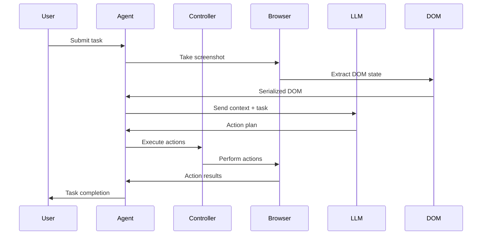
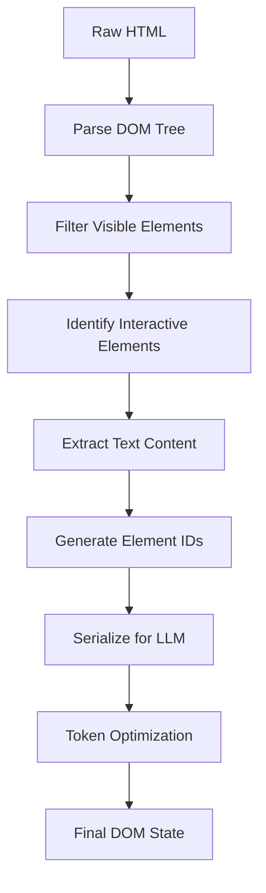
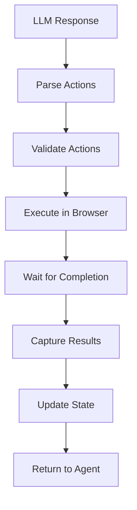

# System Architecture

## Overview

Browser Use is built on a modular, async-first architecture that enables AI agents to control web browsers through a sophisticated abstraction layer. The system is designed for reliability, extensibility, and performance.

## High-Level Architecture

```
┌─────────────────────────────────────────────────────────────────┐
│                        User Interface Layer                     │
├─────────────────────────────────────────────────────────────────┤
│  CLI  │  Python API  │  MCP Server  │  Cloud API  │  Integrations│
└─────────────────────────────────────────────────────────────────┘
                                │
┌─────────────────────────────────────────────────────────────────┐
│                         Agent Layer                             │
├─────────────────────────────────────────────────────────────────┤
│              Agent Service (Orchestration)                     │
│  ┌─────────────────┐  ┌─────────────────┐  ┌─────────────────┐ │
│  │ Message Manager │  │ System Prompts  │  │ Action Planning │ │
│  └─────────────────┘  └─────────────────┘  └─────────────────┘ │
└─────────────────────────────────────────────────────────────────┘
                                │
┌─────────────────────────────────────────────────────────────────┐
│                      Controller Layer                          │
├─────────────────────────────────────────────────────────────────┤
│                    Controller Service                          │
│  ┌─────────────────┐  ┌─────────────────┐  ┌─────────────────┐ │
│  │ Action Registry │  │ Custom Functions│  │ MCP Integration │ │
│  └─────────────────┘  └─────────────────┘  └─────────────────┘ │
└─────────────────────────────────────────────────────────────────┘
                                │
┌─────────────────────────────────────────────────────────────────┐
│                       Browser Layer                            │
├─────────────────────────────────────────────────────────────────┤
│                    Browser Session                             │
│  ┌─────────────────┐  ┌─────────────────┐  ┌─────────────────┐ │
│  │   Watchdogs     │  │   DOM Service   │  │   Screenshots   │ │
│  └─────────────────┘  └─────────────────┘  └─────────────────┘ │
└─────────────────────────────────────────────────────────────────┘
                                │
┌─────────────────────────────────────────────────────────────────┐
│                      Foundation Layer                          │
├─────────────────────────────────────────────────────────────────┤
│  ┌─────────────────┐  ┌─────────────────┐  ┌─────────────────┐ │
│  │  LLM Providers  │  │   Playwright    │  │   Utilities     │ │
│  └─────────────────┘  └─────────────────┘  └─────────────────┘ │
└─────────────────────────────────────────────────────────────────┘
```

## Core Components

### 1. Agent Layer (`browser_use/agent/`)

The Agent is the central orchestrator that coordinates all browser automation tasks.

**Key Components:**
- **Agent Service** (`service.py`): Main orchestration logic
- **Message Manager** (`message_manager/`): Handles LLM conversation state
- **System Prompts** (`system_prompt*.md`): Core AI instructions
- **Action Planning**: Converts LLM responses into executable actions

**Data Flow:**
```
User Task → Agent → LLM → Action Plan → Controller → Browser → Result → Agent
```

### 2. Controller Layer (`browser_use/controller/`)

The Controller manages action execution and provides extensibility through custom functions.

**Key Components:**
- **Controller Service** (`service.py`): Action execution coordinator
- **Action Registry** (`registry/`): Available actions and their implementations
- **Custom Functions**: User-defined extensions
- **MCP Integration**: Model Context Protocol support

**Supported Actions:**
- Navigation (go to URL, back, forward)
- Element interaction (click, type, scroll)
- Data extraction (text, attributes, screenshots)
- File operations (upload, download)
- Tab management (open, close, switch)

### 3. Browser Layer (`browser_use/browser/`)

The Browser layer provides a robust abstraction over Playwright with advanced monitoring and safety features.

**Key Components:**
- **Browser Session** (`session.py`): Main browser interface
- **Watchdogs**: Monitoring and safety systems
  - Security Watchdog: Domain restrictions and safety checks
  - Crash Watchdog: Browser crash detection and recovery
  - Downloads Watchdog: File download monitoring
  - Permissions Watchdog: Browser permission management
  - Storage State Watchdog: Session persistence
- **Event System** (`events.py`): Browser event handling
- **Profile Management** (`profile.py`): Browser profile configuration

### 4. DOM Service (`browser_use/dom/`)

Intelligent DOM processing and element identification system.

**Key Components:**
- **DOM Service** (`service.py`): Main DOM processing logic
- **Serializer** (`serializer/`): Converts DOM to LLM-friendly format
- **Element Detection**: Identifies clickable and interactive elements
- **State Optimization**: Minimizes DOM representation for token efficiency

**DOM Processing Pipeline:**
```
Raw HTML → Element Filtering → Clickable Detection → Serialization → LLM Format
```

### 5. LLM Integration (`browser_use/llm/`)

Multi-provider LLM support with consistent interfaces.

**Supported Providers:**
- OpenAI (GPT-4, GPT-4.1-mini)
- Anthropic (Claude 3.5 Sonnet, Claude 3 Haiku)
- Google (Gemini Pro, Gemini Flash)
- Groq (Llama, Mixtral)
- Azure OpenAI
- Ollama (Local models)
- AWS Bedrock

**Key Features:**
- Unified chat interface across all providers
- Token counting and cost tracking
- Response caching (where supported)
- Error handling and retry logic

## Data Flow Architecture

### 1. Task Execution Flow



### 2. DOM Processing Flow



### 3. Action Execution Flow



## Security Architecture

### 1. Multi-Layer Security

```
┌─────────────────────────────────────────┐
│           Application Layer             │
│  • Input validation                     │
│  • Action filtering                     │
│  • Custom function sandboxing          │
└─────────────────────────────────────────┘
┌─────────────────────────────────────────┐
│            Browser Layer                │
│  • Domain restrictions                  │
│  • Permission management                │
│  • Download monitoring                  │
│  • Storage isolation                    │
└─────────────────────────────────────────┘
┌─────────────────────────────────────────┐
│           System Layer                  │
│  • Process isolation                    │
│  • File system restrictions            │
│  • Network monitoring                  │
└─────────────────────────────────────────┘
```

### 2. Security Watchdogs

- **Security Watchdog**: Monitors for malicious websites and blocks dangerous actions
- **Domain Watchdog**: Enforces allowed/blocked domain lists
- **Download Watchdog**: Monitors and controls file downloads
- **Permissions Watchdog**: Manages browser permissions (camera, microphone, etc.)

## Performance Architecture

### 1. Async-First Design

All components use Python's asyncio for non-blocking operations:
- Concurrent browser sessions
- Parallel action execution
- Non-blocking LLM calls
- Asynchronous DOM processing

### 2. Optimization Strategies

**Token Optimization:**
- Intelligent DOM filtering
- Element deduplication
- Context-aware serialization
- Prompt compression

**Memory Management:**
- Lazy loading of heavy components
- Efficient screenshot handling
- DOM state caching
- Resource cleanup

**Performance Monitoring:**
- Action timing metrics
- Token usage tracking
- Memory usage monitoring
- Error rate tracking

## Extensibility Architecture

### 1. Plugin System

```python
# Custom function registration
@controller.action("custom_action")
def my_custom_action(param: str) -> str:
    """Custom action implementation"""
    return f"Executed with {param}"
```

### 2. MCP Integration

Model Context Protocol support enables:
- External tool integration
- Custom server connections
- Standardized tool interfaces
- Cross-platform compatibility

### 3. Event Hooks

```python
# Event hook registration
@agent.on_action_completed
async def on_action_completed(action_result: ActionResult):
    """Handle action completion"""
    pass
```

## Deployment Architecture

### 1. Local Deployment

```
User Machine
├── Python Environment
├── Browser Use Package
├── Playwright Browser
└── Local LLM (optional)
```

### 2. Cloud Deployment

```
Browser Use Cloud
├── Containerized Agents
├── Managed Browser Pool
├── Load Balancing
├── Auto Scaling
└── Monitoring & Analytics
```

### 3. Hybrid Deployment

```
Local Control + Cloud Execution
├── Local Agent Orchestration
├── Cloud Browser Sessions
├── Secure Communication
└── Result Synchronization
```

## Configuration Architecture

### 1. Configuration Hierarchy

```
Default Config → Environment Variables → Config File → Runtime Parameters
```

### 2. Key Configuration Areas

- **Browser Settings**: Viewport, user agent, proxy
- **Security Settings**: Domain restrictions, permissions
- **Performance Settings**: Timeouts, retry logic
- **LLM Settings**: Model selection, parameters
- **Logging Settings**: Level, format, destinations

## Monitoring & Observability

### 1. Telemetry System

- **Performance Metrics**: Action timing, success rates
- **Usage Analytics**: Feature usage, error patterns
- **Resource Monitoring**: Memory, CPU, token usage
- **Security Events**: Blocked actions, domain violations

### 2. Logging Architecture

```
Application Logs → Structured Logging → Multiple Destinations
                                    ├── Console Output
                                    ├── File Logging
                                    ├── Cloud Logging
                                    └── Analytics Platform
```

## Future Architecture Considerations

### 1. Scalability Enhancements

- Distributed agent execution
- Browser pool management
- Load balancing strategies
- Auto-scaling capabilities

### 2. Intelligence Improvements

- Multi-agent coordination
- Learning from failures
- Workflow optimization
- Predictive caching

### 3. Integration Expansions

- More LLM providers
- Additional browser engines
- Mobile browser support
- API-first architecture

This architecture provides a solid foundation for reliable, scalable, and extensible AI-powered browser automation while maintaining security and performance standards.